## Tidy Data = Happy Data 


---

## 


---

## 


---


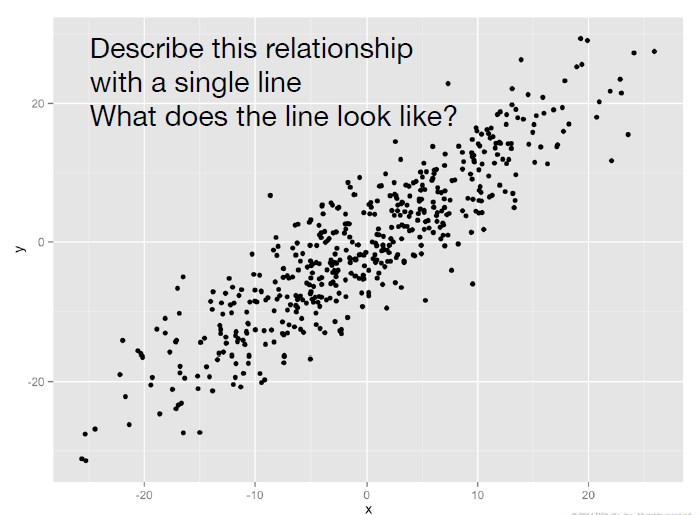

---


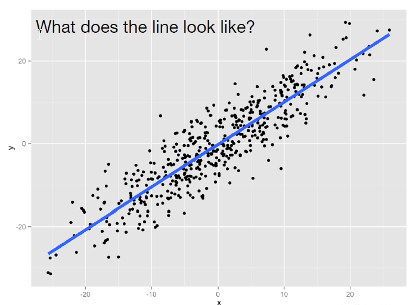

---
## Linear Regression 

<iframe src="https://gallery.shinyapps.io/simple_regression/"></iframe> 


--- 

## Linear Regression 

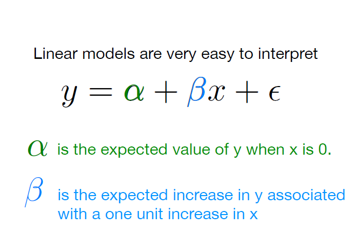


--- 


## Linear Regression 


--- 

## Linear Regression 


--- 

## Linear Regression 


--- 

## Linear Regression 

```
crime <- read.csv(crime.csv)
mod <- lm(tc2009 ~ low, data = crime)
mod
```


--- 


## Linear Regression 


--- 

## Linear Regression 


--- 

## Linear Regression 

```
coef(mod)
```


---

## Linear Regression 

```
coef(mod)
```


---

## Linear Regression 

```
summary(mod)
```


---

## Linear Regression 

```
summary(mod)
```
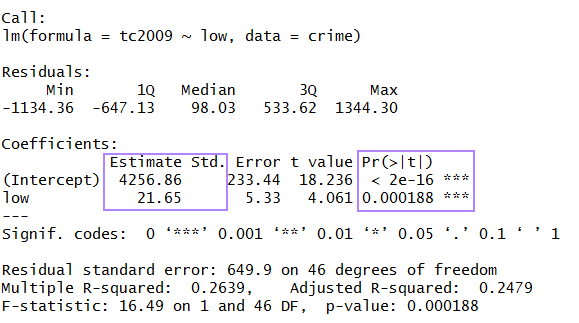


---bg:#c7d8ed


## Heights Dataset

How does height influence earnings? Fit a linear model to the heights data set, with 'earn' as the dependent variable and 'height' as the independent variable.


Describe to your neighbor the relationship between height and earnings. Do they interpret is similarly?

```
heights <- read.csv("data/heights.csv")
summary(heights)
```
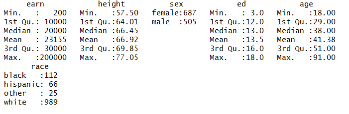


---
## Heights Dataset

```
mod <- lm(earn ~ height, data = heights)
```


---

## Heights Dataset
```
library(ggplot2)
qplot(height, earn, data = heights) +
geom_smooth(se = FALSE, method = lm)
```


---

## Heights Dataset


---

## Heights Dataset

```
summary(mod)
```


---

## Heights Dataset

```
summary(mod)
```
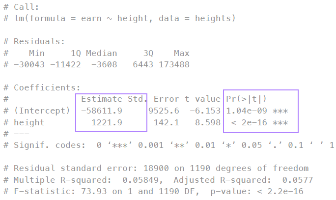


---bg:#c7d8ed

## Assumptions

- Linearity: The relationship between X and the mean of Y is linear.
- Homoscedasticity: The variance of residual is the same for any value of X.
- Independence: Observations are independent of each other.
- Normality: For any fixed value of X, Y is normally distributed.

more on assumptions: http://data.library.virginia.edu/diagnostic-plots/

---

## Assumptions

- Linearity: The relationship between X and the mean of Y is linear.

```
library(ggplot2)
qplot(height, earn, data = heights)
```

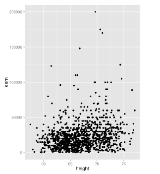

---

## Assumptions
- Homoscedasticity: The variance of residual is the same for any value of X.
- Independence: Observations are independent of each other.
- Normality: For any fixed value of X, Y is normally distributed.

```
plot(mod)
```
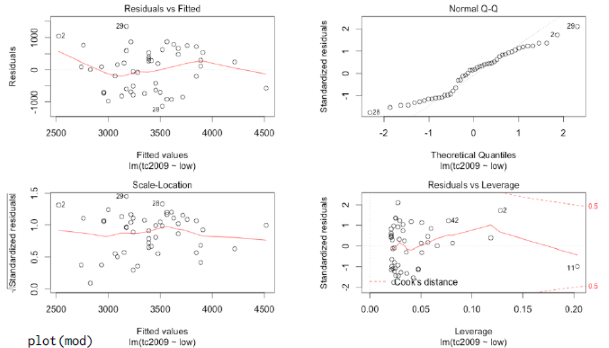


---bg:#c7d8ed

## Regression with Categorical Variable

Fit a linear model to the heights data set.
This time regress earn on race. How do
you interpret the results?

---

## Regression with Categorical Variable

```
rmod <- lm(earn ~ race, data = heights)
coef(rmod)
```
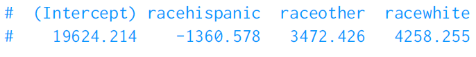

---bg:#c7d8ed


## Regression with Categorical Variable

One value of the variable is chosen as a baseline.
Each remaining value gets its own coefficient.
Interpret coefficients as the effect of moving from
the baseline value to the new value.

---

## Regression with Categorical Variable

```
coef(rmod)
```

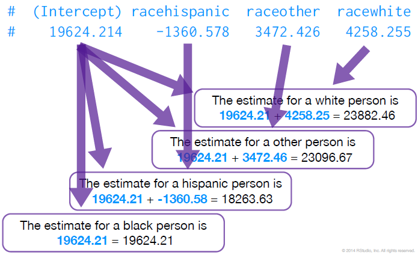

---
## Regression with Categorical Variable

```
summary(rmod)
```

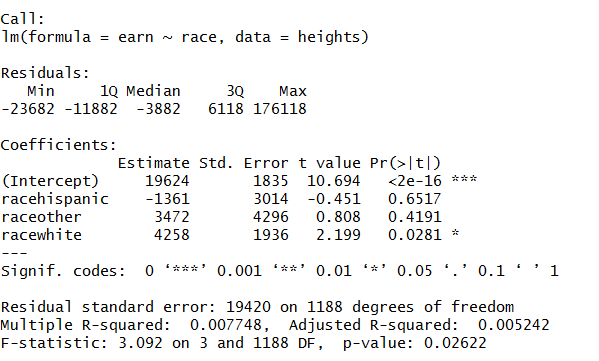


---


## Regression with Categorical Variable

```
summary(rmod)
```

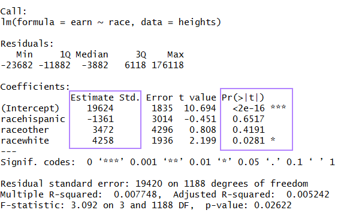


---


## Regression with Multiple Variables

```
amod <- lm(earn ~ height + sex + age + race + ed, data = heights)
amod <- lm(earn ~ ., data = heights)
```


---


## Regression with Multiple Variables

```
summary(amod)
```


---


## Resources

http://researchguides.library.tufts.edu/data

---bg:#c7d8ed


## thank you

joshua.quan@tufts.edu


---


